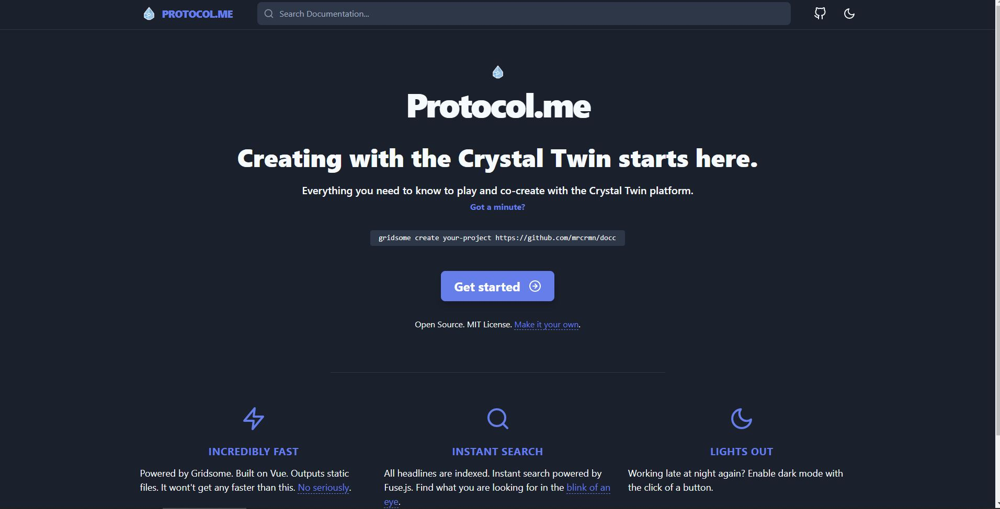
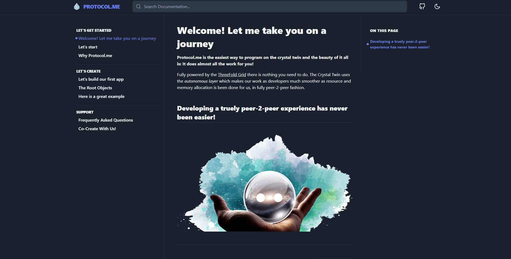
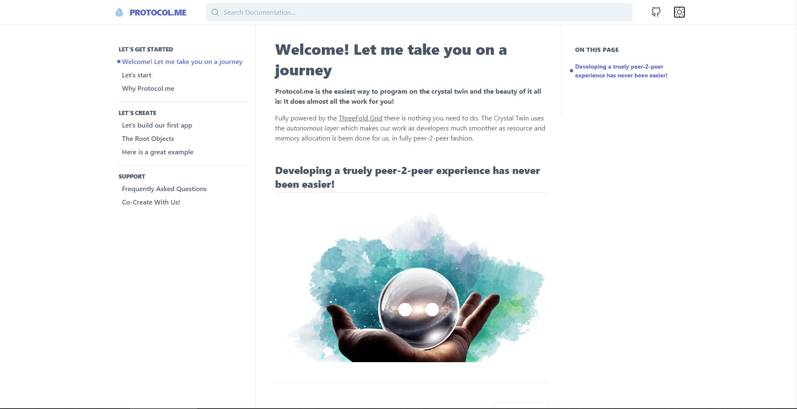

# protocol-website
This will be the Gridsome environment used for generating the protocol.me website. 

### This is how it looks like when deploying
#### The temporary homepage

#### The first wiki page (dark and light mode)



## Installation

### Install Gridsome
Gridsome is the environment that builds this project. If you haven't installed Gridsome yet you can install it with [this link](https://gridsome.org/docs/#how-to-install).

[Yes, I need to install gridsome](https://gridsome.org/docs/#how-to-install)

### Install Protocol.me environment locally
After installing `gridsome` and `cloning the project` you can build **a local server with the protocol.me site running** with this command:

```gridsome develop```

_Note: Make sure you are in the main directory when running this command._

### Build a static html website 
To build a static html website you can run this command in the terminal:

```gridsome build```

_Note: Make sure you are in the main directory when running this command._

After building the static html website is in the `/dist` folder.

---

## Writing content
All the content is written under the `/content/docs/` folder. Every page has it's own folder to organize images and other content.

- It is under the direcory [content/docs](content/docs)
- All files are markdown (.md) format

## Editing

- Always use `-` instead of `_` in naming files and directories 
- Create a new folder for each item you want to add to `protocol.me` with the naming convention in the previous point
- inside each directory put
    - `index.md` contains markdown
    - `/img` directory with images for that item
- referring to img `crystaltwin.png` from `index.md` of `crystaltwin` item can be done simpy by ``
- **Editing md files**

  - All files start with this piece of code, this is meant to control navigation into different sections defined in the sidebar menu.

    ```
    ---
    description: ''
    sidebar: 'docs'
    prev: '/docs/root-objects/'
    next: '/docs/frequently-asked-questions'
    ---


## You want to go deeper ?

Read more [on the original docc site](https://docc-theme.netlify.app)


## Create new project using `threefold gridsome-docc` 

Run `gridsome create app https://github.com/threefoldfoundation/gridsome-docc`

---
> Here are some more settings if you want to edit deep into the code and change the structure of the whole thing
## Navigation

The standard navigation on the top left is defined in the `gridsome.config.js` file. The configuration is very simple. It just needs a `settings > nav` property which takes a `links` property that defines every link that should be displayed at the top.

```js
module.exports = {
  settings: {
    nav: {
      links: [
        { path: '/docs/', title: 'Docs' }
      ]
    },
  }
}
```

Each link item needs a `path` and a `title` for the link.

## Description

The description of each page goes to the frontmatter of said page. It is an optional value but is recommended since this value is used to fill some meta properties of your page.

```md
---
description: 'your description'
---
```

## Social Links

At the top of the page, you can see some icons which link to Twitter/GitHub or personal website. These links are also defined in your `gridsome.config.js` like this:

```js

module.exports = {
  settings: {
    web: process.env.URL_WEB,
    twitter: process.env.URL_TWITTER,
    github: process.env.URL_GITHUB,
  }
```

By default these are defined in your `.env` file but can be hardcoded if you want to.

## On this Page

On the right side of the page is an overview of every headline of the current viewed page. Fortunately this list is auto-generated and you don't need to do anything.

## Google Analytics

Google Analytics is integrated via the `@gridsome/plugin-google-analytics` plugin. It needs your tracking id in order to work correctly, which can also be defined via `.env` file or hardcoded as needed.

If you don't want to use Google Analytics, simply delete this entry from your `plugins`.

Read more [here](https://gridsome.org/plugins/@gridsome/plugin-google-analytics).

```js
// ...
{
  use: '@gridsome/plugin-google-analytics',
  options: {
    id: (process.env.GA_ID ? process.env.GA_ID : 'XX-999999999-9')
  }
}
// ...
```